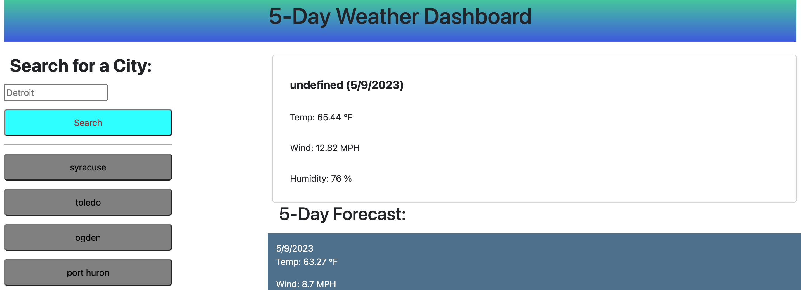

# weather-dash-2

## Description 

We were given a challenge to build a weather dashboard that will run in the browser and feature dynamically updated HTML and CSS. We were 
to use the 5 Day Weather Forecast API to retrieve weather data for cities. The searched data will be persistent so the user can see which cities they have looked up when the page refreshes.

The user story for this project is:

As a ... traveler 
I want ... to see the weather outlook for multiple cities 
So that ... I can plan a trip accordingly 

The acceptance Criteria:
GIVEN a weather dashboard with form inputs 
WHEN I search for a city 
THEN I am presented with current and future conditions for that city and that city is added to the search history 
WHEN I view current weather conditions for that city 
THEN I am presented with the city name, the date, an icon representation of weather conditions,  
the temperature, the humidity, and the the wind speed 
WHEN I view future weather conditions for that city 
THEN I am presented with a 5-day forecast that displays the date, an icon representation  
of weather conditions, the temperature, the wind speed, and the humidity 
WHEN I click on a city in the search history 
THEN I am again presented with current and future conditions for that city 

## Site Preview

## Links

[Link to GitHub Repositorty for Weather Dashboard](https://github.com/jrwesch/weather-dash-2)   
[Link to GitHub Pages view of website](https://jrwesch.github.io/weather-dash-2)
